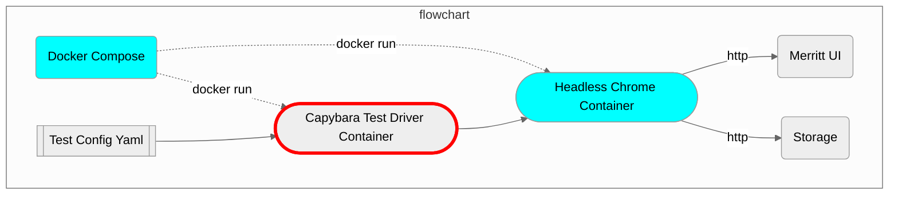

# Merritt Integration Test Driver

This library is part of the [Merritt Preservation System](https://github.com/CDLUC3/mrt-doc).



## Setup

> [!NOTE]
> This Docker Stack will not run on an arm-based Mac.

These tests can be run in the follow manner
- from AWS Code Build - [Internal Documentation](https://github.com/CDLUC3/mrt-doc-private/blob/main/uc3-mrt-integ-tests.md)
- using docker containers to run Ruby/Capybara and Headless Chrome
- run locally using a desktop installation of Ruby and Chrome

----

### Code Build Setup
- This is the recommended approach for the Merritt Team.  See the internal documentation link above

---

### Local Setup

- Install ruby 3.0
- Chrome installation is required
- `bundle install`

#### Local Test Execution

- `rspec spec`

#### Running outside of docker
- Comment out `CHROME_URL: http://chrome:4444/wd/hub`
- `bundle install`
- `INTEG_TEST_ENV=... bundle exec rspec`

---

### Docker Setup

```
docker compose build
docker compose up -d chrome
```

#### Docker Test Execution

| Domain | Scenario | Command |
| ------ | -------- | ------- |
| Production | Patching: Simple Ingest (queue __unpaused__)| `docker compose run --rm -e INTEG_TEST_ENV=production mrt-integ-tests`|
| Production | Patching: Retrieval only (queue __paused__)| `docker compose run --rm -e INTEG_TEST_ENV=production -e PREFIX=2022_03_14_1712 mrt-integ-tests`|
| Production | No Ingest | `docker compose run --rm -e INTEG_TEST_ENV=production -e INGEST_FILES=none mrt-integ-tests`|
| Production | Ingest Full Encoding Tests | `docker compose run --rm -e INTEG_TEST_ENV=production -e INGEST_FILES=encoding-tests mrt-integ-tests`|
| Production | Preview Url | `docker compose run --rm -e INTEG_TEST_ENV=production -e PREFIX=2022_03_14_1712 -e PREVIEW_URL='https://...' mrt-integ-tests`|
| Stage | Patching: Simple Ingest (queue __unpaused__)| `docker compose run --rm -e INTEG_TEST_ENV=stage mrt-integ-tests`|
| Stage | Patching: Retrieval only (queue __paused__) | `docker compose run --rm -e INTEG_TEST_ENV=stage -e PREFIX=2022_03_16_1520 mrt-integ-tests`|
| Stage | No Ingest | `docker compose run --rm -e INTEG_TEST_ENV=stage -e INGEST_FILES=none mrt-integ-tests`|
| Stage | Ingest Full Encoding Tests | `docker compose run --rm -e INTEG_TEST_ENV=stage -e INGEST_FILES=encoding-tests mrt-integ-tests`|
| Stage | Preview Url | `docker compose run --rm -e INTEG_TEST_ENV=stage -e PREFIX=2022_03_16_1520 -e PREVIEW_URL='https://...' mrt-integ-tests`|
| Development | Simple Ingest | `docker compose run --rm -e INTEG_TEST_ENV=development mrt-integ-tests`|
| Development | No Ingest | `docker compose run --rm -e INTEG_TEST_ENV=development -e INGEST_FILES=none mrt-integ-tests`|
| Development | Preview Url | `docker compose run --rm -e INTEG_TEST_ENV=development -e INGEST_FILES=none -e PREVIEW_URL='https://...' mrt-integ-tests`|

## Load test data

${ingest_queue_dir}/mrt-integ-tests/bin/create.sh

This will create files of a predictable size used in the load test config.
```
dd if=/dev/urandom of=data.10g bs=64M count=160 iflag=fullblock
dd if=/dev/urandom of=data.5g bs=64M count=80 iflag=fullblock
dd if=/dev/urandom of=data.1g bs=64M count=16 iflag=fullblock
dd if=/dev/urandom of=data.50m bs=1M count=50 iflag=fullblock
dd if=/dev/urandom of=data.1m bs=1M count=1 iflag=fullblock
dd if=/dev/urandom of=data.1k bs=1K count=1 iflag=fullblock
```

#### Cleanup
```
docker compose down
```

